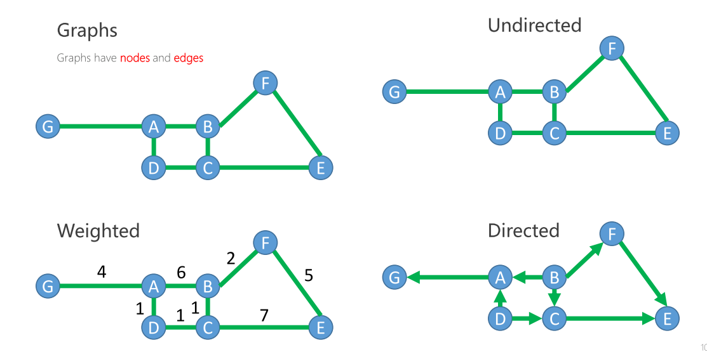
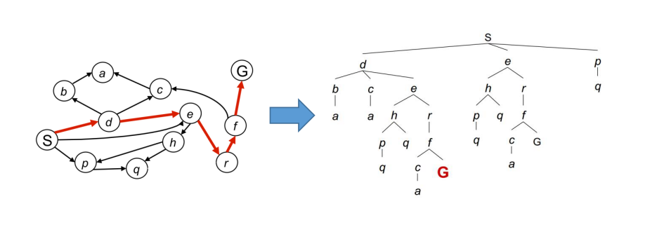
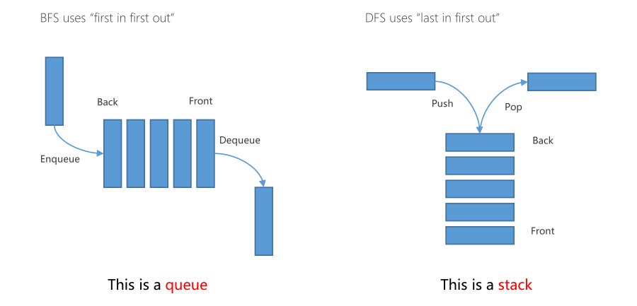
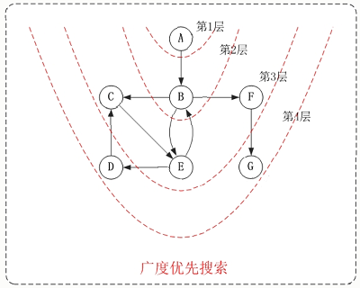
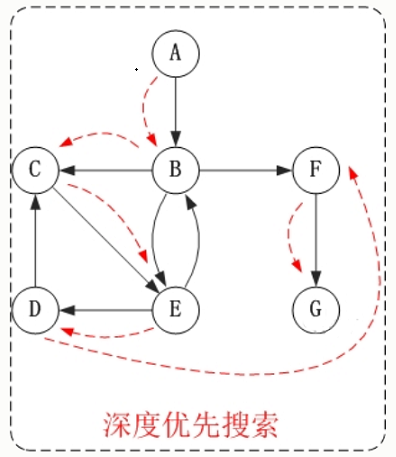
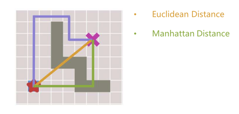

## 引言
　　本文会先介绍图搜索的一些基本知识，然后对比深度优先搜索(DFS)和广度优先搜索(BFS)，接下来介绍贪心最佳优先搜索，也就是最基本的贪心算法，最后引出 Dijkstra 和 A* 算法。本文为个人学习的总结，仅供参考，若有错漏之处，敬请指正。

## 图搜索算法概述
### 基本概念
　　首先介绍一下，图搜索算法中节点和边的概念，如下图所示，图由节点和边组成，上图中的A、B、C、D等称为节点，每两个节点之间的连接关系为边，边可以是无向的，也可以是单向的，也可以是双向的。此外每条边可以有权重，可以理解为走这条路所花费的代价。

### 搜索树
　　所谓的图搜索问题实际就是从开始节点S开始，寻找一条到G节点之间可能存在的一条路径，如下图所示，我们可以将图转化成一个树形结构，若在搜索树中找到一条路径，回溯每一个节点，就可以找到一条完整的从起点到终点的路径。然而在机器人的实际问题中，我们永远无法构建整个树，效率太低下，我们只想尽快到达目标节点，这也是此文后面介绍的主要内容。
　　

### 图搜索基本框架

+ 维护一个**容器**来存储所有要访问的节点
+ 以起始状态 Xs 来初始容器
+ Loop：
	+ 移除：根据预定义的函数计算容器中每个节点的分数，移除分数最低的节点（访问该节点）
	+ 扩展：获取该节点的所有邻居节点
	+ 存储：将所有邻居节点存入容器中
+ EndLoop

　　以上是图搜索算法的基本框架，后面介绍的算法都是基于此框架，此外还需注意：以何种方式访问容器中的节点，才能尽快到达目标节点，从而减少图节点的扩展。这是我们需要重点关注的地方，也是下面我们要讨论的几个算法的不同之处。

## 广度优先搜索(Breadth First Search) VS 深度优先搜索(Depth First Search) 

　　接下来介绍两种最基本的图的遍历算法：广度优先搜索(BFS)和深度优先搜索(DFS)，这两种算法都是基于刚刚提到的基本图搜索框架，他们主要区别在于维护的容器不同。
　　广度优先搜索维护的是一个队列(queue)，它遵循 “first in first out” 原则，总是访问容器中最先进入的元素；而深度优先搜索维护的是一个堆栈(stack) ，它遵循 “last in first out” 原则，总是访问容器中最后一个进入的元素。
　　

### 广度优先搜索(BFS)举例

遍历结果为：A→B→C→E→F→D→G
### 深度优先搜索(DFS)举例

遍历结果为：A→B→C→E→D→F→G

## 贪婪最佳优先搜索(Greedy Best First Search)

　　贪婪最佳优先搜索(Greedy Best First Search)正如其名，是一种贪心算法，前面提到的BFS和DFS只是根据“First in”或者“Last in”来选择下一个节点，而Greedy Best First Search则是根据某些规则来选择“最佳节点”，称之为启发式(heuristic)。
对于一个启发式函数，至少要满足以下两点要求：
　　+ 能够指引向着离目标更近的方向前进。
　　+ 容易计算，即能满足实时性要求。

一般地，选择欧氏距离(Euclidean Distance)或者曼哈顿距离(Manhattan Distance)来作heuristic。

　　对于没有障碍物的情况，显然这种算法会取得非常好的效果，但是如果有障碍，此算法会过分贪心地想尽快接近障碍物，而得到一个不是很优秀的解。

## Dijkstra

## A*

