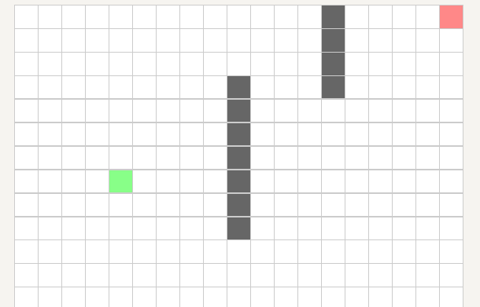

## 引言
　　JPS （Jump Point Search），又名跳点搜索算法，是由澳大利亚两位教授于 2011年提出的基于**栅格**的寻路算法。**JPS算法在保留 A* 算法的框架的同时，进一步优化了 A* 算法寻找后继节点的操作**。之前一篇文章中详细系统地讲解了 Dijsktra 和 A* 算法的流程，由于 JPS 完整地保留了 A* 的框架，若大家不了解 A* ，请先移步此文：[Dijsktra、A* 详解](https://mesywang.github.io/2020/01/23/Dijkstra-and-Astar/)。

　　前文提过 A* 在扩展节点时会扩展出很多对称的节点，浪费了很多计算资源，上面链接的文章中也介绍了一些简单的优化方法，例如，通过人为地加入某些规则使原本对称的节点计算出的 f(n) 有微小的偏差，从而打破这种对称性，使A* 有一定的倾向性。而 JPS 的本质也是**打破平衡性**，它是一个更系统的方法。
　　

　　本文，将介绍 JPS 扩展邻居节点的规则、算法的完整流程，然后讲解一个 JPS 寻路的举例，最后会给出一个基于 ROS(C++) 的 JPS 算法源码。本文为个人学习的总结，仅供参考，若有错漏之处，敬请指正。

## 寻路规则
　　A* 算法通过最简单的方式扩展一个节点，即将当前节点的所有邻居都加入 openlist 中（openlist指待访问的所有节点的集合，对应的closelist是指已经访问过的节点的集合，在以后的迭代中不再访问这些节点），如果可以用一种聪明的办法来判断哪些节点是有“价值”的，跳过一些不那么“突出”的节点，只把那些我们认为有“价值”的节点加入 openlist ，这样显然就会提高搜索的效率。这一小节就来介绍一些规则，通过这些规则，可以选出哪些有“价值”的节点。
　　
### 直线运动
　　首先考虑直线运动，包括水平运动和垂直运动两种。下面图1~图6可以简单地表示扩展一个节点的过程，灰色表示的是我们不太需要的节点。
+ 图 1：表示的是我们从灰色节点运动到绿色节点，显然前一个节点是我们不需要的。
+ 图 2：图中最上面和最下面的灰色节点，我们可以直接到达而不需经过绿色节点这条更远的路径，所以我们也认为这两个节点是不需要的。
+ 图3：同图 2 一样，绿色节点上方和下方的这两个节点也有一条更短的路径而不需要经过绿色节点，所以也认为这两个节点不必要。
+ 图4：绿色节点右上角和右下角这两个节点，可通过上方和下方的邻居到达，并且和通过绿色节点到达的路径的代价是一样的，为了简化模型，我们也把两个节点当作不必要的。
+ 图5：所以，对于绿色节点，在没有障碍物的情况下，它的所有节点都可排除，除了水平向右的这个节点。
+ 图6：这就是一个技巧，按这个规则进行考察，只要水平方向道路是“干净”的，就可以迭代地向右进行查看，而不必将每一个途经的节点都加入到 openlist 当中。

　　但是，道路“干净”是什么意思？什么时候我们需要停止上面的步骤？如下图 1 所示，我们刚刚对绿色节点右上角的节点做了假设，但是这种情况下，刚刚的规则就不成立了，因为有障碍物阻碍了道路，到达紫色节点的最短路径必须经过绿色节点，这时就不能只考虑绿色节点右边的节点了，也必须考虑这个紫色节点，在原论文中，作者把这个紫色节点叫作 **forced neighbor** ，同理，当绿色节点正下方有障碍时，右下角的节点也是一个 forced neighbor。

　　**当我们找到一个携带 forced neighbor 的节点的时候，就停止这个方向的跳跃，将当前节点加入 openlist 中。注意！！！这里我们只将当前节点加入 openlist ，并没把 forced neighbor 也加入，我们只需在以后扩展这个节点的时候，除了考虑它当前的前进方向外，另外再考虑这个 forced neighbor 所在方向即可**，可以在一会给出的实例中仔细理解这段话。

　　直线运动的最后一个规则：如上图 2 所示，**如果在水平运动时候遇到障碍物，那我们可以放心地忽略这个方向经过的所有节点**。因为我们之前已经假设过，这条路线上方和下方的灰色节点，对于当前正在跳跃的这条路径来说，已经是不需要的了，我们只在乎水平向右方向的节点，而这个障碍阻碍了我们，意味着这条路径的所有节点都是不必要的。另外，**这条规则同样适用于当跳跃到达地图边界时**。 

### 对角线运动
　　接下来考虑对角线运动，采用和直线运动相同的思维来简化模型。
+ 图 1 ：假设沿着右上角的方向移动。
+ 图 2 ：绿色节点左边和下面的灰色节点，我们可以直接到达而不需经过绿色节点这条更远的路径，所以我们认为这两个节点是不需要的。
+ 图 3 ：绿色节点左上角和右下角这两个节点，可通过左方和下方的邻居到达，并且和通过绿色节点到达的路径的代价是一样的，为了简化模型，我们也把两个节点当作不必要的。
+ 图 4 ：综上，在对角线运动的情况下，我们只需考虑剩下的上、下、右上这三个节点即可。

　　同样地，对角线运动情况下，也存在携带 forced neighbor 的节点。如下图，此时紫色节点叫作绿的节点的 forced neighbor ，若障碍物在绿色节点下方，则右下角的节点为 forced neighbor 。

　　刚刚讨论到，当对角线运动时，我们只需考虑剩下的上、下、右上这三个邻居节点，有两个邻居需要直线运动(分别是向右和向上)，前面介绍过直线运动的规则，我们只需按照之前的规则对这两个方向进行考察即可，当在这两个方向都找不到有“价值”的节点后，就沿着对角线方向移动一步，然后继续检查下个节点的水平向右和竖直向上这两个方向。**重要结论如下：先沿着两个直线方向检查，若直线方向上发现我们关注的节点，则将它们加入 openlist 中；若这两个方向上均没有我们想要的节点，就沿对角走一步，然后继续按照这个规则检查，这种对角线移动终止的条件有以下两条：**
+ **对角线上存在某一节点，这个节点在做水平和竖直方向检查时能够发现一个携带 forced neighbor 的节点，则将这一对角线上的节点加入 openlist ，并终止这个对角线的运动**。
+ **当对角线方向移动碰到障碍物或到达地图边缘时，终止这个对角线的运动**。

　　对上述第一条终止条件举例说明，如下图 1 ~ 图 4 所示：
+ 当绿色节点对角移动时，首先分别向水平和竖直方向检查，水平方向遇到了障碍物所以排除水平方向的所有节点，竖直方向遇到了地图边界，同样地排除竖直方向的所有节点，所以向对角线方向移动一步。
+ 同理，对角线上第二个、第三个的节点结论同第一个节点相同，继续向对角线方向移动。
+ 对角线上第四个节点向竖直方向查找时什么都没发现，但向水平方向检查时，发现了这个黄色节点，它携带了一个 forced neighbor (紫色节点)。
+ 将**当前节点(对角线上第四个节点)**加入 openlist 中。注意！！！这里不是将携带 forced neighbor 的黄色节点加入 openlist ，而是将当前节点加入。

## 算法流程

　　可以发现，JPS 算法流程和 [Dijsktra、A* 详解](https://mesywang.github.io/2020/01/23/Dijkstra-and-Astar/) 此文提到的 A* 算法流程几乎是一样的，**唯一的区别在于： A* 在扩展一个节点的时候会将其周围的所有邻居(除了障碍物和自身)都加入到 openlist 中，而 JPS 在扩展节点时，会根据前面介绍的规则，只将那些我们感兴趣的节点加入到 openlist 中，从而加快了搜索的效率**。

## 举例
　　如果到这里还很懵也没关系，这一小节将完整讲解一个 JPS 搜路的流程，如下图1~图10所示：
+ 图 1：绿色为起点，红色为终点，黑色为障碍物。
+ 图 2：由前面的讲解，分别向水平和竖直方向搜索，因为一直未发现我们感兴趣的节点，所以沿着对角线方向移动。
+ 图3 ：从黄色节点向水平方向搜索时，发现一个携带 forced neighbor 的节点(淡紫色)，因此结束这次搜索，同时将图 3 中的黄色节点加入 openlist ，绿色节点加入 closelist ，此时 openlist 中只有黄色节点。
+ 图4 ：从 openlist 中弹出黄色节点，沿着之前的方向(绿色 -> 黄色)开始新一轮的搜索，由于依旧是对角线方向，所以先竖直检查，什么都没发现，再水平搜索，发现一个我们感兴趣的节点(淡紫色)，因为它携带 forced neighbor ，将这个淡紫色节点加入 openlist 。因为还没达到对角搜索终止的两个条件，所以继续向对角方向移动，什么都没发现，直到到达地图边界，结束此次对角线搜索。将图 4 中的黄色节点加入 closelist  ，此时 openlist 中只有淡紫色节点。
+ 图 5：从 openlist 中弹出黄色节点(图 4 的淡紫色节点)，沿着之前的方向(灰色-> 黄色)开始搜索，水平向右直到到达地图边界。**正常来说，一次标准的直线运动到这应该结束了，但是这个黄色节点有一个 forced neighbor ，所以还必须向这个 forced neighbor 的方向进行搜索**。
+ 图 6：按照对角线运动的规则，沿着当前节点(黄色) -> 其 forced neighbor 的方向搜索。
+ 图 7：竖直方向、水平方向均没有发现，继续对角移动。
+ 图 8：按照之前的方向继续对角运动，向水平方向搜索时碰到边界，竖直方向搜索时发现目标节点，**发现目标节点等同于发现了一个携带 forced neighbor 的节点，因此将当前节点(紫色)加入 openlist ，并结束这次对角搜索**。
+ 图 9：弹出当前 openlist 唯一的节点(黄色)，按照之前的方向对角运动，水平方向搜索碰到边界，竖直方向搜索时发现目标节点，将目标节点加入 openlist ，继续对角搜索时到达地图边界，结束此次对角搜索。
+ 图 10：弹出当前 openlist 唯一的节点(红色)，发现是目标节点，因此完成整条路径的搜索，通过回溯找到最短路径。

## JPS vs A*
　　先看两幅动图，分别使用 A* 和 JPS 在同一地图中搜索路径。第一幅是 A* 搜索路径的过程，第二幅是 JPS 的搜索过程。

　　可以很明显地看出，在上述情况下，JPS 比 A* 效率要快很多，因为 JPS 采用了更聪明的方法，通过减少扩展节点的数量来提升速度。然而是否在所有情况下，JPS 都比 A* 优秀呢？再观看下面这幅动图。

　　显然，这种情况下 JPS 算法就显得不那么智能了，因为在进行直线搜索时，为了确保这个方向上没有跳点，它必须递归地查询直到到达地图边界，上述示例中，JPS 花费了很久的时间来搜索左面的地图，但一个有价值的跳点都没找到。这种情况在移动机器人上是很普遍的现象，因为机器人传感器的视场角(FOV)是有限的，它一般只能感知一定角度的环境，所以若全局地图或局部地图很大的话，就会出现上述问题。有以下结论：
+ 一般情况下，尤其是在复杂环境下，JPS 的性能要比 A* 优异，但也不是绝对的。
+ JPS 减少了加入到 openlist 中节点的数量，但是增加了搜索(查询)的次数。
+ JPS 只适用于代价均匀的栅格地图。

## 源码分享
　　最后分享一个基于 ROS(C++) 的 3D 空间下的 JPS 源码，运行结果如下图，白色方块组成的路径即为通过 JPS 搜索出的最短路径。
+ [程序源码链接](https://github.com/Mesywang/Astar-JPS-Algorithm-ROS)

## Reference
1. 深蓝学院 —— Motion Planning for Mobile Robots 课程
2. https://zerowidth.com/2013/a-visual-explanation-of-jump-point-search.html